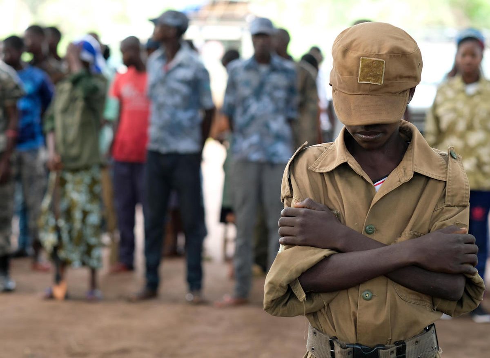

<p align="center">
  
</p>

# War and Money in Africa  
*Analyzing the Relationship Between Economic Indicators and Conflict Events (1997–2018)*  

---

##  Overview
Conflict and economic instability are deeply intertwined across Africa.  
This project investigates how macroeconomic indicators (GDP growth, inflation) correlate with **conflict events and fatalities** across five regions of Africa between **1997–2018**.  

Built using **R, Shiny, ggplot2, and Leaflet**, the dashboard provides both statistical and geospatial perspectives, making it a tool for **policy analysts, researchers, and economists** seeking to understand the dynamics of development and instability.

---

## Dashboard Preview

###  Project Overview
  
*Landing page of the Shiny app summarizing scope and motivation.*

---

###  Conflict Fatalities
  
 **Insight:** East Africa consistently recorded the highest fatalities, peaking in the 2000s–2010s, while Central and West Africa also saw sharp increases.  
 Suggests localized drivers (civil wars, insurgencies) intensified despite broader economic growth in some regions.

---

###  Conflict Events
  
 **Insight:** The number of conflict events rose in almost all regions after 2000, particularly in East and West Africa.  
 More events do not always mean higher fatalities, but they reflect widening instability and reporting improvements.

---

###  GDP Growth
  
 **Insight:** East Africa maintained strong GDP growth (>4% average), yet simultaneously experienced rising conflict fatalities.  
 This paradox highlights that **growth alone does not guarantee stability** — institutional quality, governance, and inequality matter.

---

###  Inflation
  
 **Insight:** Inflation volatility in West Africa aligns with spikes in conflict activity.  
 Suggests **economic shocks and price instability** can exacerbate unrest by increasing living costs and weakening state capacity.

---

###  Correlations

**GDP Growth vs Conflict Fatalities**  
  
 Regions like East Africa show a weak or positive correlation — economic growth coincided with high fatalities.  
 Reinforces the idea that growth without inclusive institutions may not reduce violence.  

**Inflation vs Conflict Events**  
  
 Stronger positive correlation: higher inflation is associated with more recorded conflict events.  
 Suggests inflation shocks may directly fuel unrest, protests, and instability.

---

###  Geospatial Mapping
  
 Interactive Leaflet visualization plots average fatalities per region.  
 Provides **spatial context**, showing clustering of instability in East and West Africa compared to relative stability in Southern Africa.

---

###  Advanced Analysis

#### Correlation Heatmap
We computed correlations between year, conflict fatalities, and conflict events:


**Key Insight:** While both events and fatalities have trended upward with time, the direct correlation between events and fatalities is surprisingly weak, highlighting different types of conflict dynamics across regions.

---

#### Regression Analysis
We ran a simple regression to test whether the number of conflict events predicts fatalities:

Fatalities = β₀ + β₁ * Events
R² = 0.02, β₁ ≈ +1.8 (p ≈ 0.12)

**Key Insight:** The low R² shows that conflict frequency alone doesn’t explain the severity of violence — economic and institutional factors may be stronger predictors.

##  Key Takeaways
- **Economic growth ≠ peace** → East Africa’s growth occurred alongside persistent conflict.  
- **Inflation shocks are conflict multipliers** → West Africa demonstrates volatility feeding instability.  
- **Regional diversity** → Stability in Southern Africa contrasts with recurring unrest in Central Africa.  
- **Policy implication** → Growth policies should be paired with **institutional strengthening, conflict prevention, and inclusive development.**

---

##  Methods & Tools
- **Data Sources**:  
  - [Political Conflicts in Africa (1997–2018)](https://www.kaggle.com/datasets/robertoberwa/conflicts-in-africa-from-19972018)  
  - [African Economy (1980–2022)](https://www.kaggle.com/datasets/mahmoudsaeed99/african-economy-from-1980-to-2022)  

- **Processing & Analysis:**  
  - Cleaned with `dplyr`, standardized country names with `stringr`  
  - Aggregated by **region & decade**  
  - Derived summary datasets for GDP growth, inflation, conflict events, and fatalities  

- **Visualization & App Development:**  
  - Statistical plots via **ggplot2**  
  - Geospatial plots via **Leaflet**  
  - Interactive app built with **Shiny**

---

##  How to Run the Dashboard
Clone repo and launch app locally:
```r
# Install dependencies
install.packages(c("shiny", "ggplot2", "leaflet", "dplyr", "readxl", "stringr"))

# Run the app
shiny::runApp("R/app.R")
